# Authority V3 R2 control graph and mutation matrix

Status: implementation-ready design only

Execution state: `executionAuthorized:false`

Gate count: 24

Mutation count: 39

Accepted R1/V2 mutation evidence for R2: 0

## 1. Ordered control graph

```mermaid
flowchart TD
    G01["G01 Design and five schemas valid"] --> G02["G02 Trust roots pre-anchored"]
    G02 --> G03["G03 One-shot authority valid"]
    G03 --> G04["G04 Observer service ready"]
    G04 --> G05["G05 Windows outer deny active"]
    G05 --> G06["G06 TPM replay reserve and exclusive lease"]
    G06 --> G07["G07 Source and fake contract bound"]
    G07 --> G08["G08 Runtime chain bound, barrier closed"]
    G08 --> G09["G09 Namespaces, FDs and cgroup prebound"]
    G09 --> G10["G10 Inner firewall installed"]
    G10 --> G11["G11 Inner firewall and routes read back"]
    G11 --> G12["G12 Complete capture set ready"]
    G12 --> G13["G13 Final dual rebind stable"]
    G13 --> G14["G14 Barrier authority releases once"]
    G14 --> G15["G15 Continuous containment clear"]
    G15 --> G16["G16 Observer complete"]
    G16 --> G17["G17 Block before kill verified"]
    G17 --> G18["G18 Process and cgroup teardown"]
    G18 --> G19["G19 Every privileged deletion acknowledged"]
    G19 --> G20["G20 External cleanup verified"]
    G20 --> G21["G21 Evidence sealed and byte-resolved"]
    G21 --> G22["G22 Signer chain and TPM ledger valid"]
    G22 --> G23["G23 Independent review approved"]
    G23 --> G24["G24 Synthetic PASS published"]
```



Success follows only the arrows. A failure latches its exact gate, invokes the
safest available outer+inner block, verifies block-before-kill when a target is
alive, performs cleanup, anchors `CONSUMED_FAIL` and stops. Failure cleanup does
not make later success gates pass.

## 2. Exact 24-gate registry

| # | Gate ID | Required input produced earlier | Sole decision component | Success output |
| ---: | --- | --- | --- | --- |
| 1 | `GATE_V3_R2_DESIGN_SCHEMA_VALID` | D0, five schema hashes, semantic-validator contract | design validator | P0 design root |
| 2 | `GATE_V3_R2_TRUST_ROOTS_PREANCHORED` | P0 root, registry bytes, TPM registry quote | trust verifier | registry acceptance receipt |
| 3 | `GATE_V3_R2_ISSUED_AUTHORITY_VALID` | D1 and policy signature | admission verifier | issuance acceptance receipt |
| 4 | `GATE_V3_R2_OBSERVER_SERVICE_READY` | observer process/config/key measurement | observer signer | service-ready receipt |
| 5 | `GATE_V3_R2_WINDOWS_OUTER_DENY_ACTIVE` | boot-time WFP/Hyper-V objects and readback | outer-deny verifier | outer-deny receipt |
| 6 | `GATE_V3_R2_REPLAY_AND_LEASE_RESERVED` | D1, service-ready, outer-deny, TPM/disk heads | replay-ledger anchor | atomic reservation and exclusive-lease receipts |
| 7 | `GATE_V3_R2_SOURCE_AND_CONTRACT_BOUND` | source/bundle/fake contract and exhaustive absence bytes | evidence resolver | source-contract receipt |
| 8 | `GATE_V3_R2_RUNTIME_CHAIN_BOUND` | exact OCI/runtime/mount/device/map/cgroup/shim bytes | runtime verifier | closed-barrier runtime receipt |
| 9 | `GATE_V3_R2_NAMESPACE_PREBIND_VALID` | namespace/process/cgroup/FD/socket state | enforcement verifier | namespace-prebind receipt |
| 10 | `GATE_V3_R2_INNER_FIREWALL_INSTALLED` | atomic nft transaction result | enforcement verifier | installed-object receipt |
| 11 | `GATE_V3_R2_INNER_FIREWALL_READBACK_EXACT` | kernel nft/netlink/interface/route readback | independent resolver | canonical readback receipt |
| 12 | `GATE_V3_R2_OBSERVER_CAPTURE_READY` | exact link-down capture socket set | observer signer | capture-ready receipt |
| 13 | `GATE_V3_R2_FINAL_REBIND_STABLE` | controller and observer independent rereads | barrier authority | dual rebind receipt |
| 14 | `GATE_V3_R2_BARRIER_RELEASE_AUTHORIZED` | gates 1-13 and held lease | barrier authority | exactly-once release receipt |
| 15 | `GATE_V3_R2_CONTINUOUS_CONTAINMENT_CLEAR` | ordered drift/netlink/process/FD/WFP/nft stream | containment monitor | drift-clear or latched-failure receipt |
| 16 | `GATE_V3_R2_OBSERVER_COMPLETE` | event roots, interface distributions, PACKET_STATISTICS | observer verifier | completeness/shutdown receipt |
| 17 | `GATE_V3_R2_BLOCK_BEFORE_KILL_VERIFIED` | counted WFP+nft deny with cgroup alive | enforcement verifier | block-before-kill receipt |
| 18 | `GATE_V3_R2_PROCESS_CGROUP_TEARDOWN` | kill receipt and process/cgroup inventory | cleanup coordinator | empty-cgroup receipt |
| 19 | `GATE_V3_R2_PRIVILEGED_CLEANUP_ACKNOWLEDGED` | exact created-object journal | cleanup verifier | typed deletion set |
| 20 | `GATE_V3_R2_EXTERNAL_CLEANUP_VERIFIED` | independent before/after inventories | external cleanup verifier | cleanup attestation |
| 21 | `GATE_V3_R2_EVIDENCE_SEALED_AND_RESOLVED` | P0-P3 objects, broker journal and D2 | evidence resolver | byte-resolution and broker-seal report |
| 22 | `GATE_V3_R2_SIGNER_CHAIN_AND_LEDGER_VALID` | all signatures, TPM quote, pre-review state | signer/ledger verifier | P3 accepted-for-review receipt |
| 23 | `GATE_V3_R2_INDEPENDENT_REVIEW_APPROVED` | P0-P3 roots and D2 | reviewer plus distinct final approver | D3 and P4 root |
| 24 | `GATE_V3_R2_PASS_PUBLICATION` | D3, P4 root and anchored consume-pass receipt | pass publisher; broker independently enforces create preconditions | D4 and P5 root |

The barrier authority is an explicit pre-anchored role and executable. It cannot
install rules, sign observation, advance the ledger, review evidence or write
broker files. It releases one named barrier only after exact receipts 1-13.

## 3. Producer/consumer edge contract

| Edge | Producer -> consumer | Artifact/root | Failure disposition |
| --- | --- | --- | --- |
| P0 -> P1 | design authority -> policy authority | `designRoot` | no D1; no service starts |
| registry -> D1 | registry maintainer -> policy authority | pre-anchored registry | `E_TRUST_ROOT_NOT_PREANCHORED`; no D1 |
| D1 -> observer | policy authority -> observer service | issued authority | no readiness signature on mismatch |
| observer -> ledger | observer signer -> ledger | service-ready | no reservation if absent/substituted |
| outer deny -> ledger | Windows controller -> ledger | outer-deny readback | no reservation and WSL remains stopped |
| ledger -> source | ledger anchor -> resolver | reserve+lease | second/concurrent run refused atomically |
| source -> runtime | resolver -> supervisor | source-contract receipt | no runtime start |
| runtime -> controller | supervisor -> controller | barrier-closed runtime receipt | destroy unconnected runtime |
| prebind -> nft | controller -> controller transaction | namespace-prebind | outer deny stays active; destroy runtime |
| nft -> observer | independent resolver -> observer | canonical readback | link stays down; cleanup |
| observer -> barrier | observer signer -> barrier authority | capture-ready | link/barrier stay closed |
| rebind -> release | controller+observer -> barrier authority | dual rebind | atomic block; kill; cleanup |
| release -> monitors | barrier authority -> fixture/monitors | release receipt | duplicate release is fatal |
| drift -> block | containment monitors -> controllers | drift failure receipt | atomic outer+inner block before kill |
| observer -> teardown | observer verifier -> controller | completeness/shutdown plan | quarantine on gap/drop/unclassified |
| teardown -> cleanup | supervisor -> cleanup coordinator | teardown receipt | deny remains installed |
| deletion -> external | controller -> external verifier | typed acknowledgments | any missing/nonzero ack prevents cleanup PASS |
| cleanup -> D2 | external verifier -> evidence assembler | cleanup attestation | nonce consume-fail; no D2 success |
| every producer -> broker | typed producer -> evidence broker | create-only submission | latch gate 21 failed immediately; block if active; cleanup; consume-fail |
| D2 -> resolver | evidence assembler -> evidence resolver | D2 then P3 root | resolve every P0-P3 byte; produce gate 21 report |
| resolver -> review | resolver/signer verifier -> reviewer | gate 21/22 reports | no review until every byte/signature/ledger head validates |
| D3 -> ledger | reviewer+approver -> ledger | approved D3/P4 root | timeout/unavailable approver -> consume-fail |
| consume-pass -> D4 | ledger -> publisher/broker | TPM-anchored receipt | broker refuses create on mismatch |

Gate 21 is a continuously latched durability gate: a create, write, flush,
readback, seal, index or resolve failure at any earlier phase records gate 21 as
the terminal failed gate immediately, even though successful gate 21 closes only
after cleanup. The failure path may still perform gates 17-20 for safety; it can
never resume the success path.

## 4. Exact startup and containment topology

### 4.1 Windows before WSL

Future privileged work MUST use this order:

1. The dedicated WSL distribution is stopped and its VM/vNIC absent.
2. The outer-deny service, running under its unique SID, installs persistent
   boot-time WFP filters in its pinned provider/sublayer at
   `ALE_RESOURCE_ASSIGNMENT_V4/V6`, `ALE_AUTH_CONNECT_V4/V6` and
   `OUTBOUND_TRANSPORT_V4/V6`. Every action is BLOCK and bound to the dedicated
   WSL VM creator ID, vNIC GUID or compartment as soon as each is allocated.
3. Hyper-V firewall for that VM creator ID has inbound/outbound default BLOCK,
   loopback disabled and zero allow rules.
4. A verifier reads BFE state, filter IDs/weights/conditions, Hyper-V policy and
   Windows IPv4/IPv6 route/DNS/vSwitch inventory and signs gate 5.
5. Only then may the dedicated WSL distribution start. A vNIC/compartment
   creation event is synchronously blocked until the corresponding WFP binding
   is installed and read back.

If the platform cannot guarantee this order, the host is ineligible. No slirp,
pasta, netavark, aardvark, veth, route or risky mutation can start before gate 5.

### 4.2 WSL namespaces and nftables

The enforcement controller creates a no-uplink namespace with all five required
base chains at priority `-300`, policy drop, before creating a workload link.
Candidate, relay, fake-DNS and fake-provider namespaces start with network none.
Each veth endpoint is created down, unaddressed and without route; observer
netlink subscription and capture attach precede address assignment and link-up.

Allowed tuples are exact numeric synthetic addresses and ports from D1:

```text
candidate -> relay TCP/47001
relay -> fake-dns UDP+TCP/5300
relay -> fake-provider TCP/47002
```

Rules use interface ifindex plus namespace inode and tuple ID, not names alone.
Established/related acceptance is scoped to those connection marks. All other
input/forward/output is counted drop. IPv6 chains remain policy drop even when
no IPv6 address exists. Explicit denial covers DNS 53/853, IPv4-mapped IPv6,
NAT64 `64:ff9b::/96`, metadata/link-local, loopback crossing namespaces,
multicast/broadcast, host gateways, default routes and unmanaged interfaces.

There is no NAT, masquerade, forwarding to the WSL uplink, Windows route or
physical interface. Fake DNS returns only the committed invalid-domain fixture;
the candidate has no resolver configuration and cannot issue DoH/DoT.

### 4.3 Runtime-owner containment

The fake CLI has empty capability sets, `noNewPrivileges`, no device, no host or
runtime-socket mount and no inherited socket. Only stdin/stdout/stderr plus exact
barrier descriptors exist. UID/GID maps, OCI spec, cgroup v2 limits, shim
processes and namespace inodes are byte/object exact.

seccomp denies `bpf`, namespace creation/attachment, mount, device, keyring and
unapproved netlink operations to the runtime owner/fake CLI. eBPF programs are
absent. procfs is read-only with sensitive namespaces/FD paths masked; sysfs is
read-only and network/device mutation paths absent. Observer/controller netlink
sockets are held only by their distinct cgroups. Continuous inventory covers
netlink events, BPF program/map IDs, proc namespace links, sysfs network/device
objects, mounts, devices, processes, cgroups, FDs, sockets and runtime helpers.

Any drift invokes one atomic controller transaction: install/read back outer WFP
and inner nft counted deny for every bound tuple, record target cgroup still
alive, then issue cgroup kill. Kill before verified block is gate 17 failure.

## 5. Observer protocol

The observer service and signer have distinct OS, key and binary identities.
Service readiness is signed before nonce reservation. Netlink subscription
begins before any workload interface creation. For every veth, AF_PACKET capture
is attached while the link is down and unaddressed; `attachSequence < linkUpSequence`.
Capture-ready is the exact set equality between controller interface readback
and observer socket/interface/direction records.

The taxonomy and load envelopes are fixed by the schema specification. Pristine
requires:

- one capture record for every interface and both directions;
- zero sequence gaps;
- zero unclassified events;
- `PACKET_STATISTICS` available on every socket;
- zero kernel drops;
- per-socket delivered totals reconciling to classified event totals;
- signed shutdown after block/kill and queue drain.

M16 alone expects at least one kernel drop, zero unclassified and gate 16
failure. M17 alone expects zero drops, exactly one unclassified event and gate 16
failure. Those mutation expectations never relax pristine criteria.

Shutdown is complete only after counted block, cgroup kill, capture queue drain,
per-socket PACKET_STATISTICS, final interface/netlink inventory, final event-root
signature, socket closure and empty observer cgroup readback.

## 6. Mutation execution contract

No mutation is authorized by this design. A future mutation run requires a
one-shot D1 grant naming exactly one mutation ID, component, host/boot,
source/tree and expiry. Each mutation gets a new nonce, disposable state and
fresh pre-run inventory.

The mutation driver records the actual before object, mutation operation and
after object. Boolean flips, mocked verdicts, assertion edits and fixture return
overrides receive no credit. A mutation is killed only when its one expected
gate emits its one expected error. An earlier refusal means `NOT_EXERCISED`.

Restoration classes:

- `SRC`: inverse patch, rebuild, exact source/binary hashes, `git diff` empty.
- `OBJECT`: delete/recreate by exact handle or kernel object ID; normalized
  independent inventory byte-equal to before.
- `RUN`: destroy the whole disposable run; every created object has a typed ack.
- `STORE`: quarantine the store/run; never overwrite or repair sealed bytes.
- `LEDGER`: anchor `CONSUMED_FAIL`; never delete/reuse the nonce or repair the
  mutated ledger in place.

Every class ends with a fresh pristine verification under a new nonce. Failed
restoration blocks all later runs.

## 7. Explicit 26 mandatory R1 requirement IDs

These requirement aliases remain visible and are mapped transparently into R2.
Combined R2 mutations change one real compound control and still emit one error;
M15 is split into service-ready and capture-ready cases.

| Mandatory ID | Required scenario | R2 mutation |
| --- | --- | --- |
| `R1-M01` | real-binary sentinel present | M01 |
| `R1-M02` | provider route present | M02 |
| `R1-M03` | compatibility manifest bytes mismatch | M03 |
| `R1-M04` | wrapper bytes mismatch | M03 |
| `R1-M05` | firewall table missing | M04 |
| `R1-M06` | default accept | M05 |
| `R1-M07` | hook/priority wrong | M05 |
| `R1-M08` | rootless runtime can edit enforcement | M06 |
| `R1-M09` | namespace replaced | M07 |
| `R1-M10` | extra interface/route | M08 |
| `R1-M11` | direct DNS bypass | M09 |
| `R1-M12` | IPv6 bypass | M09 |
| `R1-M13` | relay external egress | M10 |
| `R1-M14` | inherited socket/FD | M11 |
| `R1-M15` | observer not ready | M14 and M15 |
| `R1-M16` | observer packet loss | M16 |
| `R1-M17` | unclassified packet | M17 |
| `R1-M18` | observer signer substituted | M12 |
| `R1-M19` | replay after restart | M13 |
| `R1-M20` | kill before block | M18 |
| `R1-M21` | deletion failure | M19 |
| `R1-M22` | process/cgroup leak | M20 |
| `R1-M23` | temp root/fake secret leak | M21 |
| `R1-M24` | concurrent run | M22 |
| `R1-M25` | post-cleanup drift | M23 |
| `R1-M26` | PASS attempted before cleanup | M24 |

The remaining R1 IDs map transparently as follows. Compound mappings mutate one
compound real control and have one deterministic gate; split mappings are the
former multi-gate cases the R2 review required separating.

| R1 ID(s) | R2 mutation(s) | Disposition |
| --- | --- | --- |
| `R1-M27`, `R1-M28` | M25 | key substitution is expressed as one unapproved real rotation transition |
| `R1-M29`, `R1-M30` | M26 | sealed path replacement changes both file ID and bytes and is one broker identity failure |
| `R1-M31` | M15 | interface omission is the exact capture-ready-set failure |
| `R1-M32` | M27 | PACKET_STATISTICS unavailable remains separate |
| `R1-M33`, `R1-M34` | M28 | starting a disallowed helper changes the measured helper-chain object |
| `R1-M35` | M29, M30 | split pre-reservation and active-runtime clock gates |
| `R1-M36` | M31 | ledger unavailable remains reservation-gate failure |
| `R1-M37` | M32, M33 | split reservation-time and post-evidence corruption gates |
| `R1-M38` | M34, M35 | split cleanup-verifier identity and semantic false-equivalence gates |
| `R1-M39` | M36, M37 | split Windows prebarrier deny and postcleanup inventory gates |
| new R2 | M38, M39 | explicit valid-backup restore and cross-machine-copy rejection |

## 8. R2 matrix: exactly 39 mutations

Each row names one real changed object/control, exactly one gate and one
deterministic error. Restoration always includes the class procedure plus a new
pristine run.

| ID | Real mutation operation | Expected gate | Deterministic error | Restore |
| --- | --- | --- | --- | --- |
| `M01_REAL_BINARY_PRESENT` | Add only the committed harmless M01 sentinel file to the actual bundle/OCI tree. | `GATE_V3_R2_SOURCE_AND_CONTRACT_BOUND` | `REAL_BINARY_SENTINEL_PRESENT` | SRC |
| `M02_PROVIDER_ROUTE_PRESENT` | Add a reserved-prefix kernel route through an existing enforcement interface; send no packet. | `GATE_V3_R2_INNER_FIREWALL_READBACK_EXACT` | `PROVIDER_ROUTE_PRESENT` | OBJECT |
| `M03_CONTRACT_ARTIFACT_BYTES_MISMATCH` | Replace the signed snapshot+wrapper compound bundle object with a rebuilt different-byte object. | `GATE_V3_R2_SOURCE_AND_CONTRACT_BOUND` | `CONTRACT_BUNDLE_BYTES_MISMATCH` | SRC |
| `M04_FIREWALL_TABLE_MISSING` | Before gate 10 evaluates, use the mutation install transaction that omits the required enforcement table from actual kernel state. | `GATE_V3_R2_INNER_FIREWALL_INSTALLED` | `FIREWALL_TABLE_MISSING` | OBJECT |
| `M05_FIREWALL_POLICY_HOOK_PRIORITY_WRONG` | Replace one real base chain so policy is accept and hook priority is not `-300`. | `GATE_V3_R2_INNER_FIREWALL_READBACK_EXACT` | `FIREWALL_BASE_CHAIN_CANONICAL_MISMATCH` | OBJECT |
| `M06_ROOTLESS_RUNTIME_CAN_EDIT` | Change namespace ownership/map and perform one actual nft edit as runtime owner. | `GATE_V3_R2_NAMESPACE_PREBIND_VALID` | `ROOTLESS_RUNTIME_EDIT_SUCCEEDED` | RUN |
| `M07_NAMESPACE_REPLACED` | Recreate/reattach candidate to a new network namespace after prebind. | `GATE_V3_R2_FINAL_REBIND_STABLE` | `NETWORK_NAMESPACE_REPLACED` | RUN |
| `M08_EXTRA_INTERFACE_OR_ROUTE` | Add one actual link and bound extra route to candidate namespace. | `GATE_V3_R2_FINAL_REBIND_STABLE` | `EXTRA_INTERFACE_OR_ROUTE` | OBJECT |
| `M09_DNS_IPV6_BYPASS` | Add one IPv4-mapped-IPv6 UDP/53 address, route and accept rule as one transaction. | `GATE_V3_R2_INNER_FIREWALL_READBACK_EXACT` | `DNS_IPV6_BYPASS_PRESENT` | OBJECT |
| `M10_RELAY_EXTERNAL_EGRESS` | Add a reserved external-test prefix route/allow from relay. | `GATE_V3_R2_INNER_FIREWALL_READBACK_EXACT` | `RELAY_EXTERNAL_EGRESS_PRESENT` | OBJECT |
| `M11_INHERITED_SOCKET_OR_FD` | Pass one bound unapproved socket through actual OCI preserve-fds. | `GATE_V3_R2_NAMESPACE_PREBIND_VALID` | `INHERITED_SOCKET_OR_FD` | RUN |
| `M12_OBSERVER_SIGNER_SUBSTITUTED` | Sign real service readiness with an unpinned same-algorithm key. | `GATE_V3_R2_OBSERVER_SERVICE_READY` | `OBSERVER_SIGNER_SUBSTITUTED` | RUN |
| `M13_REPLAY_AFTER_RESTART` | Reserve, restart ledger service, then attempt the same authority/barrier. | `GATE_V3_R2_REPLAY_AND_LEASE_RESERVED` | `NONCE_ALREADY_RESERVED_OR_CONSUMED` | LEDGER |
| `M14_OBSERVER_SERVICE_NOT_READY` | Delay/terminate observer service before service-ready signature. | `GATE_V3_R2_OBSERVER_SERVICE_READY` | `OBSERVER_SERVICE_NOT_READY` | RUN |
| `M15_OBSERVER_CAPTURE_NOT_READY` | Keep one real interface but omit its link-down capture socket/readiness entry. | `GATE_V3_R2_OBSERVER_CAPTURE_READY` | `OBSERVER_CAPTURE_SET_INCOMPLETE` | RUN |
| `M16_OBSERVER_PACKET_LOSS` | Use the exact M16 bounded load and 4,096-byte receive buffer until kernel drop count is positive. | `GATE_V3_R2_OBSERVER_COMPLETE` | `OBSERVER_KERNEL_DROPS_NONZERO` | RUN |
| `M17_UNCLASSIFIED_PACKET` | Emit exactly one M17 64-byte local packet absent from the classifier. | `GATE_V3_R2_OBSERVER_COMPLETE` | `UNCLASSIFIED_PACKET_EXACTLY_ONE` | RUN |
| `M18_KILL_SWITCH_ORDER_BROKEN` | Execute cgroup kill before counted outer+inner deny readback. | `GATE_V3_R2_BLOCK_BEFORE_KILL_VERIFIED` | `KILL_BEFORE_BLOCK` | SRC |
| `M19_RULE_DELETE_FAILURE` | Hold a namespace reference so deletion returns nonzero or object remains. | `GATE_V3_R2_PRIVILEGED_CLEANUP_ACKNOWLEDGED` | `PRIVILEGED_DELETE_NOT_ACKNOWLEDGED` | OBJECT |
| `M20_PROCESS_CGROUP_LEAK` | Use the mutation fixture child that remains in the real cgroup after parent exit. | `GATE_V3_R2_PROCESS_CGROUP_TEARDOWN` | `PROCESS_CGROUP_LEAK` | RUN |
| `M21_TEMP_ROOT_OR_SECRET_LEAK` | Retain one fake-only sentinel inode/mount after teardown. | `GATE_V3_R2_EXTERNAL_CLEANUP_VERIFIED` | `TEMP_ROOT_OR_FAKE_SECRET_LEAK` | OBJECT |
| `M22_CONCURRENT_RUN` | Race two valid distinct nonces for one concurrency domain in real transactions. | `GATE_V3_R2_REPLAY_AND_LEASE_RESERVED` | `CONCURRENT_RUN_LEASE_CONFLICT` | LEDGER |
| `M23_POST_CLEANUP_DRIFT` | Create one run-labelled link after deletion and before external after-snapshot. | `GATE_V3_R2_EXTERNAL_CLEANUP_VERIFIED` | `POST_CLEANUP_DRIFT` | OBJECT |
| `M24_PASS_WRITTEN_BEFORE_CLEANUP` | Ask broker to CREATE_NEW D4 before P3 cleanup root or D3. | `GATE_V3_R2_PASS_PUBLICATION` | `PASS_PREREQUISITE_ORDER_INVALID` | STORE |
| `M25_SIGNER_KEY_OR_ROTATION_INVALID` | Activate a real substitute key/epoch without old/new/maintainer/approver rotation signatures. | `GATE_V3_R2_SIGNER_CHAIN_AND_LEDGER_VALID` | `SIGNER_ROTATION_INVALID` | RUN |
| `M26_SEALED_EVIDENCE_OBJECT_REPLACED` | Delete/recreate a sealed object at the same path with a new file ID and bytes while index retains old identity. | `GATE_V3_R2_EVIDENCE_SEALED_AND_RESOLVED` | `EVIDENCE_FILE_ID_OR_BYTES_MISMATCH` | STORE |
| `M27_PACKET_STATISTICS_UNAVAILABLE` | Run mutation observer that omits the real PACKET_STATISTICS call at shutdown. | `GATE_V3_R2_OBSERVER_COMPLETE` | `PACKET_STATISTICS_UNAVAILABLE` | SRC |
| `M28_RUNTIME_HELPER_CHAIN_DRIFT` | Only after gate 5 outer deny, replace the approved absent/helper set by starting a measured slirp/pasta helper attached to the still-barriered candidate; send no packet. | `GATE_V3_R2_RUNTIME_CHAIN_BOUND` | `RUNTIME_HELPER_CHAIN_DRIFT` | RUN |
| `M29_MONOTONIC_CLOCK_PRE_RESERVATION` | Measured clock adapter returns duplicate/rollback during TPM reservation. | `GATE_V3_R2_REPLAY_AND_LEASE_RESERVED` | `MONOTONIC_CLOCK_INVALID_PRE_RESERVATION` | SRC |
| `M30_MONOTONIC_CLOCK_RUNTIME` | Measured clock adapter rolls back after barrier release. | `GATE_V3_R2_CONTINUOUS_CONTAINMENT_CLEAR` | `MONOTONIC_CLOCK_INVALID_RUNTIME` | SRC |
| `M31_LEDGER_UNAVAILABLE` | Stop/lock the real disposable ledger during reservation. | `GATE_V3_R2_REPLAY_AND_LEASE_RESERVED` | `REPLAY_LEDGER_UNAVAILABLE` | LEDGER |
| `M32_LEDGER_CORRUPT_AT_RESERVATION` | Flip one closed disk event byte before disk/TPM comparison. | `GATE_V3_R2_REPLAY_AND_LEASE_RESERVED` | `LEDGER_CORRUPT_AT_RESERVATION` | LEDGER |
| `M33_LEDGER_CORRUPT_AFTER_EVIDENCE` | Alter one prior event/hash after D2 but before signer/ledger verification. | `GATE_V3_R2_SIGNER_CHAIN_AND_LEDGER_VALID` | `LEDGER_CORRUPT_PRE_REVIEW` | LEDGER |
| `M34_CLEANUP_VERIFIER_IDENTITY_SUBSTITUTED` | Use a different real verifier binary/key on equal inventories. | `GATE_V3_R2_EXTERNAL_CLEANUP_VERIFIED` | `CLEANUP_VERIFIER_IDENTITY_INVALID` | RUN |
| `M35_CLEANUP_VERIFIER_FALSE_EQUIVALENCE` | Pinned mutation verifier signs unequal real before/after inventories as equal. | `GATE_V3_R2_EXTERNAL_CLEANUP_VERIFIED` | `CLEANUP_EQUIVALENCE_FALSE` | SRC |
| `M36_WINDOWS_OUTER_DENY_PREBARRIER_DRIFT` | Remove one actual WFP V6 filter after the install API returns but before gate 5 performs its independent readback. | `GATE_V3_R2_WINDOWS_OUTER_DENY_ACTIVE` | `WINDOWS_OUTER_DENY_INCOMPLETE` | OBJECT |
| `M37_WINDOWS_NETWORK_POSTCLEANUP_DRIFT` | Add one reserved-prefix Windows route after cleanup and before external after-snapshot. | `GATE_V3_R2_EXTERNAL_CLEANUP_VERIFIED` | `WINDOWS_NETWORK_POSTCLEANUP_DRIFT` | OBJECT |
| `M38_LEDGER_VALID_BACKUP_RESTORE` | Restore an internally valid older SQLite backup while TPM NV head stays newer. | `GATE_V3_R2_REPLAY_AND_LEASE_RESERVED` | `LEDGER_BACKUP_RESTORE_REJECTED` | LEDGER |
| `M39_LEDGER_CROSS_MACHINE_COPY` | Copy an internally valid ledger to a machine lacking the bound TPM key/NV identity. | `GATE_V3_R2_REPLAY_AND_LEASE_RESERVED` | `LEDGER_CROSS_MACHINE_COPY_REJECTED` | LEDGER |

R1 multi-gate cases are now split: service/capture readiness (M14/M15),
pre/runtime clock failure (M29/M30), reservation/post-evidence corruption
(M32/M33), cleanup identity/semantic compromise (M34/M35), and Windows
prebarrier/postcleanup drift (M36/M37). Every R2 row has one gate only.

M04 corrects the R1 sequencing defect: the actual mutation occurs inside the
install transaction before gate 10 produces any success receipt. It cannot
delete a table after an already-passed installation gate and still claim that
gate failed.

## 9. Gate/verdict acceptance rules

- Pristine D2 success: gates 1-20 passed, zero failed, cleanup true, PASS absent;
  gate 21 resolves the completed P3 root including D2 and gate 22 validates the
  signer/ledger chain before review.
- Mutation D2: exactly one expected gate failed, no later success gate, verdict
  `SYNTHETIC_FAIL` or `QUARANTINED`; never PASS.
- D3 approval: gates 1-23 passed and reviewer/final approver distinct.
- Final approver unavailable or deadline expired: no D3 approval, TPM-anchored
  `CONSUMED_FAIL`, lease released, no D4.
- D4: D3 approved, nonce `CONSUMED_PASS`, gates 1-23 prior-passed and gate 24
  create-new receipt. No other combination validates.

## 10. Final design state

The graph and matrix are specifications only.

- `executionAuthorized:false`
- `syntheticFixtureExecutionAuthorized:false`
- `realCandidateExecutionAuthorized:false`
- `providerExecutionAuthorized:false`
- `realCandidateInvocations:0`
- `providerCalls:0`
